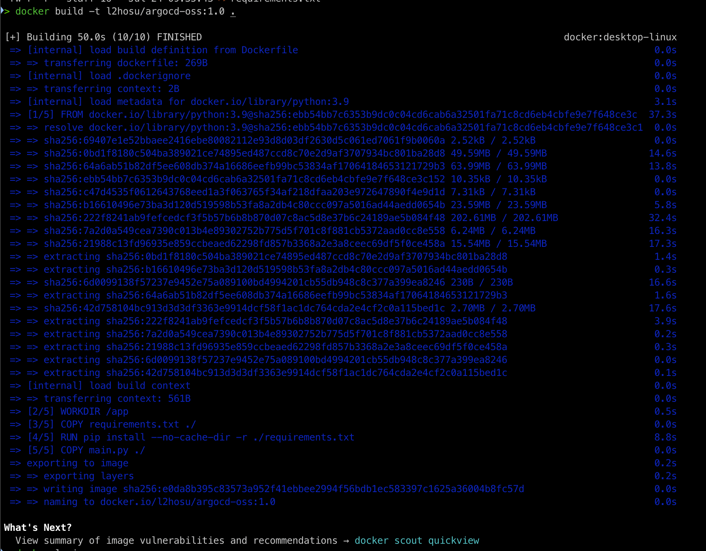
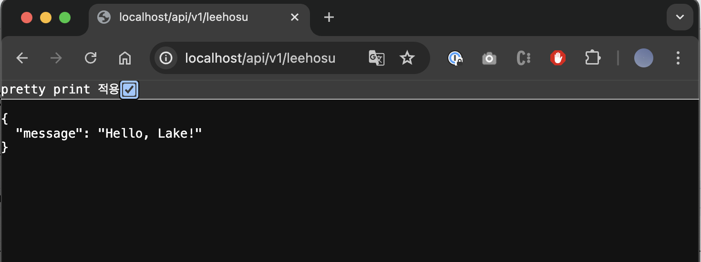
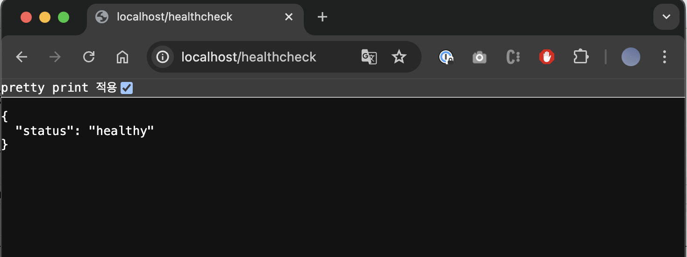
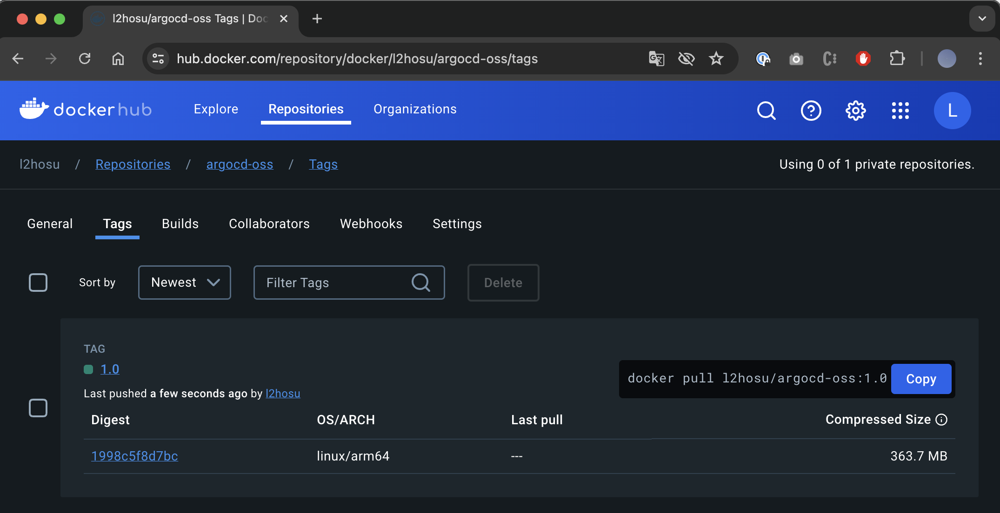

## Overview

## docker build

## docker run 후 ps

## docker result

## docker hub

## helm install

## k8s result

---
### 목표

나만의 웹서비스를 제작하고, 컨테이너화 할 수 있는 도커파일, Kubernetes에 배포하기 위한 Helm Chart를 작성해 봅니다.

과제 통과를 위해서 반드시 아래 사항을 준수해 주세요.
- 디렉터리 및 파일 배치
  - 나만의 서비스를 반드시 본인 github 계정 디렉터리를 생성하고, 그 아래 작성해주세요.
  - 본인 디렉터리의 최상단에는 반드시 `Dockerfile` 이 위치해야 합니다.  
   (이 조건을 달성하지 못하면 CI가 실패합니다.)
  - 본인 디렉터리 아래에 한해서, `Dockerfile`의 위치를 제외한 나머지 파일들은 자유롭게 작성해도 됩니다.
  - 단, 본인 디렉터리 최상단에서 `docker build -t [이미지명] .` 명령을 수행 했을때 성공적으로 이미지가 빌드 되어야 합니다.
- 빌드 된 이미지의 동작
  - 나만의 웹서비스는 반드시 8080포트에서 동작해야 합니다.
  - 빌드 된 이미지는 별도의 파라미터 없이 `docker run -d -p [포워딩 포트번호]:8080 [이미지명]` 으로 실행 했을 때 문제 없이 서비스 되도록 만들어야 합니다.
- 웹서비스 개발언어 및 서비스 구조
  - 본인이 선호하는 어떤 언어, 어떤 프레임워크를 활용해도 상관 없습니다.
  - UI, 디자인이 존재하지 않는 단순 api서비스를 제작해도 상관 없습니다.
  - 단, 필수 api를 두개 만들어야 합니다. (응답값은 신경쓰지 않습니다.)
    1. /api/v1/[본인 github계정]
    2. /healthcheck 
- Helm Chart 내용
  - chart 디렉토리 이름은 `charts`여야 합니다.
  - values.yaml의 구조는 자유롭게 작성해도 됩니다.
  - Deployment를 이용해 배포 해야합니다.
    1. `spec.containers[0].image`는 `"{{ .Values.image.name }}"` 형태로 작성되어야 합니다
  - Service를 이용해 서비스를 노출 해야합니다.
    1. Service Type은 NodePort로 작성해야합니다.
    2. NodePort는 30080을 사용해야합니다.
    3. `localhost:30080/` 을 통해 정상적으로 응답을 받아야합니다.

- (Optional) 도커 이미지 최적화를 하면 더 좋습니다. ([참고](https://thearchivelog.dev/article/optimize-docker-image/))
- [키워드를 활용한 PR과 이슈 연결 방법](https://docs.github.com/ko/issues/tracking-your-work-with-issues/linking-a-pull-request-to-an-issue#linking-a-pull-request-to-an-issue-using-a-keyword)을 참고하여 이슈와 PR을 연결해주세요. (수동연결 x)

### 참고사항

도커의 개념과 Dockerfile을 작성하기 위해 아래 문서를 참고 하면 좋아요.
- [Dockerfile 작성 공식 문서](https://docs.docker.com/engine/reference/builder/)
- [왕초보를 위한 도커 사용법](https://mysetting.io/slides/xxj85vnvey) (Docker Toolbox관련 내용은 deprecate된 내용)

PR을 올리고 머지하기 위해 아래 사항들을 참고하면 좋아요.
- Repo에 브랜치등을 생성하거나 Push할 수 있는 권한이 없으므로 fork 후 작업해야 해요.
- [PR의 네이밍 컨벤션](https://flank.github.io/flank/pr_titles/)을 참고해주세요.
- [DCO](https://github.com/apps/dco) 봇의 체크를 통과하기 위한 조건을 참고하여 커밋해주세요.
- [GPG](https://www.44bits.io/ko/post/add-signing-key-to-git-commit-by-gpg)를 이용해 커밋하는 방법을 이해하여 서명된 커밋을 작성해주세요.
- [커밋 메시지 컨벤션](https://www.conventionalcommits.org/en/v1.0.0/)도 적용할 수 있으면 좋아요. 꼭 따르지 않더라도, 너무 의미없는 커밋 메시지는 지양해주세요.(Optional)

궁금한게 있다면 언제든 질문하기!

